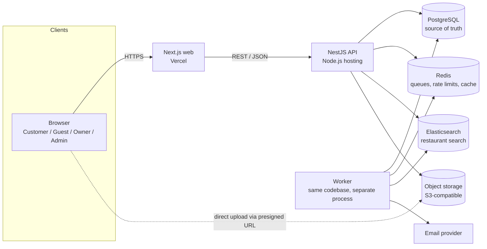
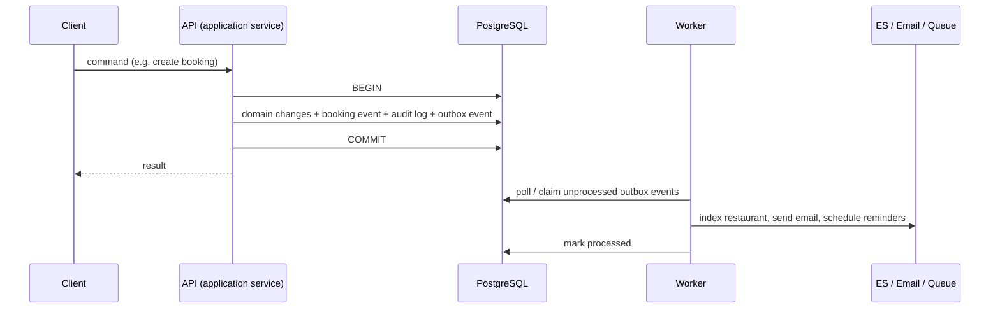

# Architecture

Status: **proposed** (Phase 1). Nothing described here beyond the repository
scaffold is implemented yet. Technology choices marked `T-xx` are pending in
[open-questions.md](../open-questions.md#technical-decisions).

## System context



| Component        | Responsibility                                                                                                                                                                                     |
| ---------------- | -------------------------------------------------------------------------------------------------------------------------------------------------------------------------------------------------- |
| Web (`apps/web`) | UI in Vietnamese and English; server-rendered public pages; calls the API only. Never talks to PostgreSQL, Redis, or Elasticsearch.                                                                |
| API (`apps/api`) | All business rules, authorization, transactions. Writes domain changes and outbox events atomically.                                                                                               |
| Worker           | Processes outbox events and scheduled jobs: notifications, reminders, search indexing, completion, expiry. Proposed as a second entry point of `apps/api` (T-08) so domain code is not duplicated. |
| PostgreSQL       | Source of truth. Enforces the booking overlap guarantee with an exclusion constraint.                                                                                                              |
| Redis            | Job queues (T-07), rate limiting, and caching where justified (Phase 13). Never a source of truth.                                                                                                 |
| Elasticsearch    | Read model for discovery: keyword, filters, geo-distance, sorting. Rebuildable from PostgreSQL at any time.                                                                                        |
| Object storage   | Restaurant photos. The API issues presigned upload URLs and stores object keys only.                                                                                                               |
| Email provider   | Transactional email. Behind an interface; provider not chosen.                                                                                                                                     |

## Write path and side effects



Rules:

- A request never calls Elasticsearch, email, or queues inside the database
  transaction. Side effects happen after commit via the outbox, so a rollback can
  never leave an email sent or an index updated for a change that did not happen.
- Outbox processing is at-least-once; consumers are idempotent (e.g. delivery rows
  are unique per notification and channel).

## Read paths

| Read                                     | Source                                                         |
| ---------------------------------------- | -------------------------------------------------------------- |
| Search, filters, map pins, radius search | Elasticsearch                                                  |
| Restaurant detail, menu, photos, reviews | PostgreSQL (cacheable)                                         |
| Availability                             | PostgreSQL via the availability engine (advisory)              |
| Bookings, dashboards                     | PostgreSQL                                                     |
| Reports, analytics                       | PostgreSQL (aggregate queries or materialised views, Phase 12) |

Search results that need availability (the "availability" filter) are resolved by
running the availability engine on the top search hits (T-10).

## API internal layering

Each API module follows the same layering. Dependencies point inwards only.

```text
modules/<context>/
├── domain/          entities, value objects, policies, state machines
│                    pure TypeScript: no NestJS, no Prisma, no I/O
├── application/     use cases (commands/queries), authorization, transactions,
│                    ports (interfaces) for repositories and external services
├── infrastructure/  Prisma repositories, Elasticsearch, storage, email adapters
└── presentation/    controllers, request/response DTOs, validation
```

| Layer          | May depend on                          | Must not                                                   |
| -------------- | -------------------------------------- | ---------------------------------------------------------- |
| domain         | `packages/shared` types                | import NestJS, Prisma, HTTP, clock (the clock is injected) |
| application    | domain, ports                          | know about HTTP or Prisma types                            |
| infrastructure | application ports, `packages/database` | contain business rules                                     |
| presentation   | application                            | contain business rules or talk to Prisma                   |

The scaffold currently has `controllers/ services/ dto/ entities/ repositories/`
per module. Proposal (T-14): replace these with the four layers above when each
module is first implemented. The mapping is:

| Scaffold folder        | Proposed layer                                                    |
| ---------------------- | ----------------------------------------------------------------- |
| `controllers/`, `dto/` | `presentation/`                                                   |
| `services/`            | `application/`                                                    |
| `entities/`            | `domain/`                                                         |
| `repositories/`        | `application/` (port) + `infrastructure/` (Prisma implementation) |

## Module map

| Module            | Owns                                                                                                                             | Status           |
| ----------------- | -------------------------------------------------------------------------------------------------------------------------------- | ---------------- |
| `auth`            | registration, login, tokens, guards                                                                                              | scaffold         |
| `users`           | profiles, user admin operations                                                                                                  | scaffold         |
| `restaurants`     | onboarding, profile, location, photos, menu, taxonomy links, resources, combinations, opening hours, blackouts, booking settings | scaffold         |
| `bookings`        | availability engine, allocation engine, booking lifecycle, jobs for completion/expiry                                            | scaffold         |
| `reviews`         | reviews, replies, flags, moderation                                                                                              | scaffold         |
| `collections`     | collections                                                                                                                      | scaffold         |
| `notifications`   | notifications, deliveries, reminders, announcements                                                                              | scaffold         |
| `admin`           | admin-only use cases that span modules (reports, analytics)                                                                      | scaffold         |
| `favorites`       | favorites (separate concept from collections)                                                                                    | **proposed new** |
| `search`          | Elasticsearch index mapping, indexing, search queries                                                                            | **proposed new** |
| `recommendations` | rule-based recommender behind an interface                                                                                       | **proposed new** |
| `audit`           | audit log writer (used by all modules) and reader (admin)                                                                        | **proposed new** |
| `locations`       | countries, cities, geocoding interface                                                                                           | **proposed new** |

Cross-module calls go through the other module's application services (exported
Nest providers), never through its repositories or tables.

## Cross-cutting concerns

| Concern         | Approach                                                                                                                            |
| --------------- | ----------------------------------------------------------------------------------------------------------------------------------- |
| Time            | Injected `Clock`; restaurant-timezone conversions in one domain utility (T-06).                                                     |
| Money           | `Money` value object (bigint minor units + currency) in the domain layer (T-05).                                                    |
| Authorization   | Checked in application services using the [permission matrix](../domain/permissions.md).                                            |
| Transactions    | Owned by application services. Repositories accept a transaction context.                                                           |
| Audit           | `AuditLogger` port called inside the transaction of the audited change.                                                             |
| Localisation    | UI strings in the web app (vi, en). Email templates per locale. Taxonomy labels stored per locale (T-21). Restaurant content: Q-31. |
| Geocoding       | `Geocoder` interface with no provider; owners enter coordinates in phase 1 (T-18).                                                  |
| Recommendations | `RecommendationService` interface; phase 1 implementation scores by rules.                                                          |
| Payments        | Not implemented. Money fields and a `PENDING` state exist so a payment step can be added later.                                     |
