# Entity Relationship Diagram

Generated from `packages/database/prisma/schema.prisma`. Only keys and the most important columns are shown.
GitHub renders this diagram automatically; in VS Code use a Mermaid preview extension.

```mermaid
erDiagram
    User ||--o{ Restaurant : "owns"
    User ||--o{ Booking : "books (customer)"
    User ||--o{ Review : "writes"
    User ||--o{ ReviewReply : "replies"
    User ||--o{ Favorite : "has"
    User ||--o{ Collection : "has"
    User ||--o{ Notification : "receives"
    User ||--o{ AuditLog : "acts"

    Restaurant ||--o| RestaurantBookingSetting : "settings"
    Restaurant ||--o{ OpeningHour : "opens"
    Restaurant ||--o{ RestaurantClosure : "closes"
    Restaurant ||--o{ RestaurantResource : "tables"
    Restaurant ||--o{ ResourceCombinationRule : "combine rules"
    Restaurant ||--o{ Booking : "receives"
    Restaurant ||--o{ Review : "has"
    Restaurant ||--o{ RestaurantImage : "images"
    Restaurant ||--o{ Menu : "menus"
    Restaurant ||--o{ RestaurantAnnouncement : "announces"
    Restaurant ||--o{ RestaurantCuisine : ""
    Restaurant ||--o{ RestaurantAmenity : ""
    Restaurant ||--o{ Favorite : ""
    Restaurant ||--o{ CollectionRestaurant : ""

    Cuisine ||--o{ RestaurantCuisine : ""
    Amenity ||--o{ RestaurantAmenity : ""
    Menu ||--o{ MenuItem : "items"
    Collection ||--o{ CollectionRestaurant : ""

    ResourceCombinationRule ||--o{ ResourceCombinationRuleResource : ""
    RestaurantResource ||--o{ ResourceCombinationRuleResource : ""

    Booking ||--o{ BookingResource : "allocated"
    RestaurantResource ||--o{ BookingResource : "used by"
    Booking ||--o| Review : "reviewed"
    Review ||--o| ReviewReply : "reply"

    User {
        uuid id PK
        string email UK
        string name
        UserRole role
    }
    Restaurant {
        uuid id PK
        uuid ownerId FK
        string name
        string slug UK
        RestaurantStatus status
        string citySlug
        string timezone
        int priceLevel
    }
    RestaurantBookingSetting {
        uuid id PK
        uuid restaurantId FK,UK
        int bookingDurationMinutes
        int slotIntervalMinutes
        int bufferMinutes
        int cancellationDeadlineMins
    }
    OpeningHour {
        uuid id PK
        uuid restaurantId FK
        DayOfWeek dayOfWeek
        time openTime
        time closeTime
    }
    RestaurantClosure {
        uuid id PK
        uuid restaurantId FK
        timestamptz startAt
        timestamptz endAt
    }
    RestaurantResource {
        uuid id PK
        uuid restaurantId FK
        string name
        ResourceType type
        ResourceStatus status
        int capacity
        int priority
    }
    ResourceCombinationRule {
        uuid id PK
        uuid restaurantId FK
        int priority
        bool isActive
    }
    ResourceCombinationRuleResource {
        uuid ruleId PK,FK
        uuid resourceId PK,FK
    }
    Booking {
        uuid id PK
        string bookingNumber UK
        uuid restaurantId FK
        uuid customerId FK
        BookingStatus status
        int partySize
        timestamptz startsAt
        timestamptz endsAt
    }
    BookingResource {
        uuid id PK
        uuid bookingId FK
        uuid resourceId FK
        timestamptz allocatedFromAt
        timestamptz allocatedUntilAt
        bool isActive
    }
    Review {
        uuid id PK
        uuid bookingId FK,UK
        uuid restaurantId FK
        uuid customerId FK
        int overallRating
    }
    ReviewReply {
        uuid id PK
        uuid reviewId FK,UK
        uuid authorId FK
    }
    Cuisine {
        uuid id PK
        string slug UK
    }
    Amenity {
        uuid id PK
        string slug UK
    }
    RestaurantCuisine {
        uuid restaurantId PK,FK
        uuid cuisineId PK,FK
    }
    RestaurantAmenity {
        uuid restaurantId PK,FK
        uuid amenityId PK,FK
    }
    Menu {
        uuid id PK
        uuid restaurantId FK
    }
    MenuItem {
        uuid id PK
        uuid menuId FK
        decimal price
    }
    RestaurantImage {
        uuid id PK
        uuid restaurantId FK
    }
    RestaurantAnnouncement {
        uuid id PK
        uuid restaurantId FK
    }
    Favorite {
        uuid userId PK,FK
        uuid restaurantId PK,FK
    }
    Collection {
        uuid id PK
        uuid userId FK
        string name
    }
    CollectionRestaurant {
        uuid collectionId PK,FK
        uuid restaurantId PK,FK
    }
    Notification {
        uuid id PK
        uuid userId FK
        timestamptz readAt
    }
    AuditLog {
        uuid id PK
        uuid actorId FK
        string action
        string targetType
    }
```

Notes not visible in the diagram:

- `Booking` has four `User` relations: `customer`, `createdBy`, `cancelledBy`, `noShowBy` (only `customer` is drawn).
- `OpeningHour` is unique per `(restaurantId, dayOfWeek)` → one opening period per day.
- Availability uses: `RestaurantBookingSetting`, `OpeningHour`, `RestaurantClosure`, `RestaurantResource`, `ResourceCombinationRule`, `BookingResource`.
