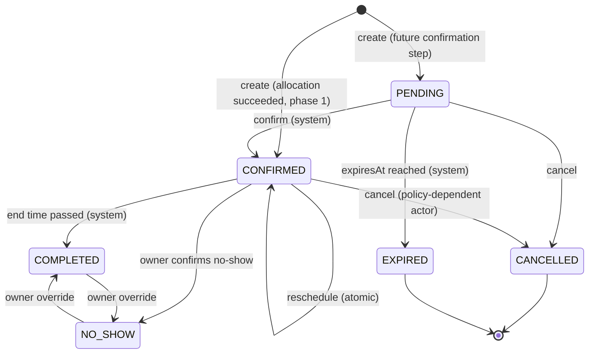

# Booking lifecycle

## States

| Status      | Meaning                                                                                                                      | Holds resources?                                             | Terminal                   |
| ----------- | ---------------------------------------------------------------------------------------------------------------------------- | ------------------------------------------------------------ | -------------------------- |
| `PENDING`   | Allocated but not yet confirmed. Reserved for flows that need a confirmation step (e.g. future payment). Has an `expiresAt`. | Yes                                                          | No                         |
| `CONFIRMED` | Allocated and confirmed. The normal state after a successful booking in phase 1.                                             | Yes                                                          | No                         |
| `CANCELLED` | Cancelled before it took place.                                                                                              | No (released)                                                | Yes                        |
| `EXPIRED`   | A `PENDING` booking that was not confirmed before `expiresAt`.                                                               | No (released)                                                | Yes                        |
| `COMPLETED` | Took place. Set by the system after the end time, or by owner override.                                                      | Historical ([Q-26](../open-questions.md#business-questions)) | Yes, except owner override |
| `NO_SHOW`   | Party did not arrive. Confirmed by the owner.                                                                                | Historical ([Q-26](../open-questions.md#business-questions)) | Yes, except owner override |

**Phase 1 note.** Payment is not required, so booking creation allocates and confirms
in one transaction: a new booking is persisted directly as `CONFIRMED`. No phase-1
flow is known that creates a `PENDING` booking ([Q-17](../open-questions.md#business-questions)).
`PENDING` and `EXPIRED` are still part of the model and the state machine, so a
confirmation step can be added without a schema change.

## State machine



A failed booking attempt (no candidate available) creates **no** booking row; it is
not a state.

## Transition table

| #   | From → To                              | Actor                                    | Guard                                                                                                                                               | Effects (same transaction)                                                                              |
| --- | -------------------------------------- | ---------------------------------------- | --------------------------------------------------------------------------------------------------------------------------------------------------- | ------------------------------------------------------------------------------------------------------- |
| T1  | ∅ → `CONFIRMED`                        | Customer, Guest (online); Owner (manual) | Restaurant `APPROVED`; slot valid (see [availability](availability-and-allocation.md)); allocation succeeds; idempotency key unused or same request | Insert booking + allocations; events `CREATED`, `CONFIRMED`; outbox `BookingConfirmed`; audit if manual |
| T2  | ∅ → `PENDING`                          | —                                        | Not used in phase 1                                                                                                                                 | Insert booking + allocations with `expiresAt`                                                           |
| T3  | `PENDING` → `CONFIRMED`                | System                                   | `now < expiresAt`                                                                                                                                   | Event; outbox                                                                                           |
| T4  | `PENDING` → `EXPIRED`                  | System                                   | `now ≥ expiresAt`                                                                                                                                   | Release allocations; event; outbox                                                                      |
| T5  | `PENDING` → `CANCELLED`                | Same actors as T6                        | —                                                                                                                                                   | Release allocations; event; outbox                                                                      |
| T6  | `CONFIRMED` → `CANCELLED`              | see below                                | see below                                                                                                                                           | Release allocations; event; outbox `BookingCancelled`; audit for owner/admin                            |
| T7  | `CONFIRMED` → `CONFIRMED` (reschedule) | see below                                | see below                                                                                                                                           | Release old allocations + insert new ones atomically; update times; event `RESCHEDULED`; outbox         |
| T8  | `CONFIRMED` → `COMPLETED`              | System                                   | `now ≥ endsAt`                                                                                                                                      | Event; outbox (review invitation, if any)                                                               |
| T9  | `CONFIRMED` → `NO_SHOW`                | Owner                                    | `now ≥ startsAt` ([Q-24](../open-questions.md#business-questions))                                                                                  | Event; audit                                                                                            |
| T10 | `COMPLETED` ↔ `NO_SHOW`                | Owner                                    | Override window ([Q-25](../open-questions.md#business-questions))                                                                                   | Event `STATUS_OVERRIDDEN`; audit                                                                        |

### Who may cancel or reschedule a `CONFIRMED` booking

| Booking kind           | Customer (own)           | Owner                                                                                             | Admin |
| ---------------------- | ------------------------ | ------------------------------------------------------------------------------------------------- | ----- |
| Authenticated, online  | Yes, before the deadline | **No** (owner cannot cancel a confirmed booking; restaurant-side cancellation goes through admin) | Yes   |
| Guest, online          | — (no management link)   | Yes, on the guest's behalf                                                                        | Yes   |
| Manual (owner-entered) | —                        | [Q-21](../open-questions.md#business-questions)                                                   | Yes   |

Open points on this table: whether the deadline applies to owner-handled guest
changes ([Q-19](../open-questions.md#business-questions)), what happens after the
deadline for customers ([Q-20](../open-questions.md#business-questions)), how a
restaurant requests an admin cancellation ([Q-22](../open-questions.md#business-questions)),
and admin cancellation rules ([Q-23](../open-questions.md#business-questions)).

## Cancellation deadline

- `deadline = startsAt − cancellationDeadlineMinutes` (default 120).
- The deadline is an instant; comparing it with `now` does not depend on timezone.
  The timezone matters when **displaying** it and when the owner configures policy.
- The value is **snapshotted onto the booking** at creation, so later policy changes
  do not alter existing bookings (proposal, [Q-40](../open-questions.md#business-questions)).

## Rescheduling

Rescheduling keeps the same booking (same id and reference) and changes its time.
It is one database transaction:

```text
BEGIN
  lock booking row (FOR UPDATE)
  check: status = CONFIRMED, actor permitted, now < deadline(original start)
  lock restaurant row (FOR KEY SHARE); validate new slot
  mark current allocations released
  run allocation for the new slot (may reuse the same resources)
  success → update startsAt/endsAt, version++, insert new allocations,
            event RESCHEDULED, outbox BookingRescheduled
  failure → ROLLBACK (release is undone; the original booking is untouched)
COMMIT
```

Because the release and the new allocation happen in one transaction, the original
reservation is never observable as released unless the new allocation committed.
Releasing first inside the transaction is deliberate: it lets a reschedule move by
30 minutes on the same table without conflicting with itself.

Which fields can change on reschedule (time only, or party size too) and whether the
number of reschedules is limited are open ([Q-35](../open-questions.md#business-questions)).

## Completion and no-show

- **Completion (T8):** a scheduled job moves `CONFIRMED` bookings with `endsAt ≤ now`
  to `COMPLETED`. The update is conditional (`WHERE status = 'CONFIRMED'`), so it never
  overwrites a concurrent owner decision.
- **No-show suggestion:** the system sets `noShowSuggestedAt` on a booking; status is
  unchanged. The owner confirms with T9.
- **Unresolved:** the platform has no arrival/check-in signal, so it is unclear what
  the system can base a no-show suggestion on, or how suggestion interacts with
  automatic completion at the end time ([Q-24](../open-questions.md#business-questions)).

## Expiration

Only `PENDING` bookings expire. A job transitions `PENDING` bookings with
`expiresAt ≤ now` using a conditional update and releases their allocations.

## Events and notifications

Every transition writes a `BookingEvent` and an outbox event in the same
transaction. The worker turns outbox events into notifications:

| Transition | Notification type                                                                                       |
| ---------- | ------------------------------------------------------------------------------------------------------- |
| T1         | `BOOKING_CREATED`, `BOOKING_CONFIRMED` ([Q-39](../open-questions.md#business-questions): both, or one?) |
| T5, T6     | `BOOKING_CANCELLED`                                                                                     |
| T7         | `BOOKING_RESCHEDULED`                                                                                   |
| T1, T7     | schedule `BOOKING_REMINDER_24H`, `BOOKING_REMINDER_2H`                                                  |
| T4–T7      | cancel or reschedule pending reminders                                                                  |
