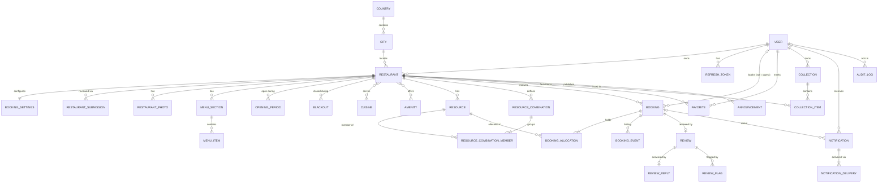

# Entity model

Core entities, their responsibilities, and their relationships. Field-level detail
lives in the [proposed Prisma schema](../database/proposed-schema.prisma).

Conventions:

- Primary keys are UUIDs (see [T-23](../open-questions.md#technical-decisions)).
- All instants are `timestamptz` (UTC). Wall-clock values (opening hours) are stored
  as minutes since local midnight and interpreted in the restaurant timezone.
- Money is `amountMinor` (integer minor units) + `currency` (ISO 4217).
- Rows referenced by history (resources, bookings, users) are never hard-deleted.

## Bounded contexts

| Context               | Entities                                                                                                                             | Owning API module                                 |
| --------------------- | ------------------------------------------------------------------------------------------------------------------------------------ | ------------------------------------------------- |
| Identity              | User, RefreshToken                                                                                                                   | `auth`, `users`                                   |
| Geography             | Country, City                                                                                                                        | `restaurants` (reference data)                    |
| Catalog               | Restaurant, RestaurantSubmission, RestaurantPhoto, Cuisine, Amenity, MenuSection, MenuItem, OpeningPeriod, Blackout, BookingSettings | `restaurants`                                     |
| Reservation resources | Resource, ResourceCombination, ResourceCombinationMember                                                                             | `restaurants` (configuration), read by `bookings` |
| Booking               | Booking, BookingAllocation, BookingEvent                                                                                             | `bookings`                                        |
| Reviews               | Review, ReviewReply, ReviewFlag                                                                                                      | `reviews`                                         |
| Engagement            | Favorite, Collection, CollectionItem                                                                                                 | `collections` (+ proposed `favorites`)            |
| Notifications         | Notification, NotificationDelivery, Announcement                                                                                     | `notifications`                                   |
| Platform              | AuditLog, OutboxEvent                                                                                                                | `admin` / shared infrastructure                   |

## Entities

### Identity

| Entity           | Purpose                                                                               | Key rules                                                                        |
| ---------------- | ------------------------------------------------------------------------------------- | -------------------------------------------------------------------------------- |
| **User**         | Account with email, password hash, name, phone, role, status, preferred locale.       | Email unique (case-insensitive). Role ∈ `CUSTOMER`, `RESTAURANT_OWNER`, `ADMIN`. |
| **RefreshToken** | Server-side record of an issued refresh token (hashed), grouped in rotation families. | Revocable; rotation detects reuse.                                               |

### Geography

| Entity      | Purpose                                              | Key rules               |
| ----------- | ---------------------------------------------------- | ----------------------- |
| **Country** | ISO code, name, default timezone, default currency.  | Reference data.         |
| **City**    | Name, country, default timezone, centre coordinates. | Unique (country, slug). |

### Catalog

| Entity                         | Purpose                                                                                                                                         | Key rules                                                                                                                             |
| ------------------------------ | ----------------------------------------------------------------------------------------------------------------------------------------------- | ------------------------------------------------------------------------------------------------------------------------------------- |
| **Restaurant**                 | Profile, location (address, lat/lng, city, country), timezone, currency, status, owner, denormalised rating aggregates.                         | Only `APPROVED` restaurants are public, searchable, and bookable. Timezone and currency are required.                                 |
| **RestaurantSubmission**       | One admin review cycle: submitted at/by, decision (`APPROVED`/`REJECTED`), decided at/by, admin notes.                                          | At most one undecided submission per restaurant.                                                                                      |
| **RestaurantPhoto**            | Object-storage key, caption, sort order, cover flag.                                                                                            | At most one cover photo per restaurant.                                                                                               |
| **Cuisine** / **Amenity**      | Platform taxonomy with slug and localised labels (vi, en).                                                                                      | Managed by admins; linked many-to-many.                                                                                               |
| **MenuSection** / **MenuItem** | Menu structure; item has name, description, price (money), availability flag.                                                                   | Item price currency = restaurant currency.                                                                                            |
| **OpeningPeriod**              | Weekday + open/close minutes.                                                                                                                   | `open < close` (no overnight); periods of the same weekday do not overlap.                                                            |
| **Blackout**                   | Restaurant-wide closure `[startsAt, endsAt)` as instants, with reason.                                                                          | `startsAt < endsAt`.                                                                                                                  |
| **BookingSettings**            | 1:1 with restaurant: slot interval, duration (default 120), buffer, cancellation/reschedule deadline (default 120 min), allocation preferences. | All minute values positive (buffer may be 0). Defaults for slot interval and buffer: [Q-12](../open-questions.md#business-questions). |

### Reservation resources

| Entity                        | Purpose                                                                                                                          | Key rules                                                                                                   |
| ----------------------------- | -------------------------------------------------------------------------------------------------------------------------------- | ----------------------------------------------------------------------------------------------------------- |
| **Resource**                  | Bookable unit: name, type, capacity, active flag, priority, optional fee (money).                                                | Capacity ≥ 1. Name unique per restaurant. Fee currency = restaurant currency. Archived rather than deleted. |
| **ResourceCombination**       | Named, restaurant-defined set of resources that may be allocated together, with its seating capacity, priority, and active flag. | ≥ 2 members, all from the same restaurant.                                                                  |
| **ResourceCombinationMember** | Join between combination and resource.                                                                                           | Unique (combination, resource).                                                                             |

### Booking

| Entity                | Purpose                                                                                                                                                                                                                       | Key rules                                                                                               |
| --------------------- | ----------------------------------------------------------------------------------------------------------------------------------------------------------------------------------------------------------------------------- | ------------------------------------------------------------------------------------------------------- |
| **Booking**           | Reservation: restaurant, optional customer, contact snapshot, party size, preferences, `startsAt`/`endsAt`, snapshotted timezone/duration/buffer/deadline, status, source, fee snapshot, idempotency key, optimistic version. | Guest booking ⇔ `customerId` is null. Status transitions per [booking lifecycle](booking-lifecycle.md). |
| **BookingAllocation** | One resource held by one booking for `[startsAt, occupiedUntil)`, where `occupiedUntil = endsAt + buffer`. `releasedAt` set when it stops blocking.                                                                           | **No two unreleased allocations of the same resource overlap** (database exclusion constraint).         |
| **BookingEvent**      | Append-only history: type, from/to status, previous/new times, actor, reason.                                                                                                                                                 | Written in the same transaction as the change.                                                          |

### Reviews

| Entity          | Purpose                                                                                           | Key rules                                                                |
| --------------- | ------------------------------------------------------------------------------------------------- | ------------------------------------------------------------------------ |
| **Review**      | Ratings (overall, food, service, atmosphere), text, status (`PUBLISHED`/`HIDDEN`), edit deadline. | One per booking; booking must be `COMPLETED`; author = booking customer. |
| **ReviewReply** | Owner's reply.                                                                                    | One per review (see [Q-28](../open-questions.md#business-questions)).    |
| **ReviewFlag**  | Report on a review with reason and resolution status.                                             | Escalates to admin; does not hide the review automatically.              |

### Engagement

| Entity             | Purpose                                        | Key rules                        |
| ------------------ | ---------------------------------------------- | -------------------------------- |
| **Favorite**       | Customer ↔ restaurant bookmark.                | Unique (user, restaurant).       |
| **Collection**     | Named list with visibility `PUBLIC`/`PRIVATE`. | Owned by one customer.           |
| **CollectionItem** | Restaurant in a collection, with position.     | Unique (collection, restaurant). |

### Notifications

| Entity                   | Purpose                                                                                     | Key rules                                                                       |
| ------------------------ | ------------------------------------------------------------------------------------------- | ------------------------------------------------------------------------------- |
| **Notification**         | Message for a recipient (user, or guest contact email), with type, payload, read state.     | In-app notifications exist only for users.                                      |
| **NotificationDelivery** | Per-channel delivery (`IN_APP`, `EMAIL`) with status, attempts, last error, scheduled time. | Unique (notification, channel). Retries are idempotent.                         |
| **Announcement**         | Restaurant-authored message.                                                                | Audience is an open question ([Q-30](../open-questions.md#business-questions)). |

### Platform

| Entity          | Purpose                                                                                                    | Key rules                                                               |
| --------------- | ---------------------------------------------------------------------------------------------------------- | ----------------------------------------------------------------------- |
| **AuditLog**    | Actor (user/system), actor role, action, target type/id, restaurant, metadata, request context, timestamp. | Append-only. Written in the same transaction as the audited change.     |
| **OutboxEvent** | Domain event awaiting processing by the worker (indexing, notifications, reminders).                       | Written in the same transaction as the change; processed at-least-once. |

## Relationship diagram

Notes:

- `REVIEW` links to `BOOKING` (not directly to restaurant and user); restaurant and
  author are denormalised onto the review for querying, and must match the booking.
- `BOOKING_ALLOCATION` carries `restaurantId` redundantly so allocations can be
  queried per restaurant without joining bookings.
- `AUDIT_LOG` targets are polymorphic (`targetType`, `targetId`) and intentionally
  have no foreign key, so audit rows survive any later data changes.
