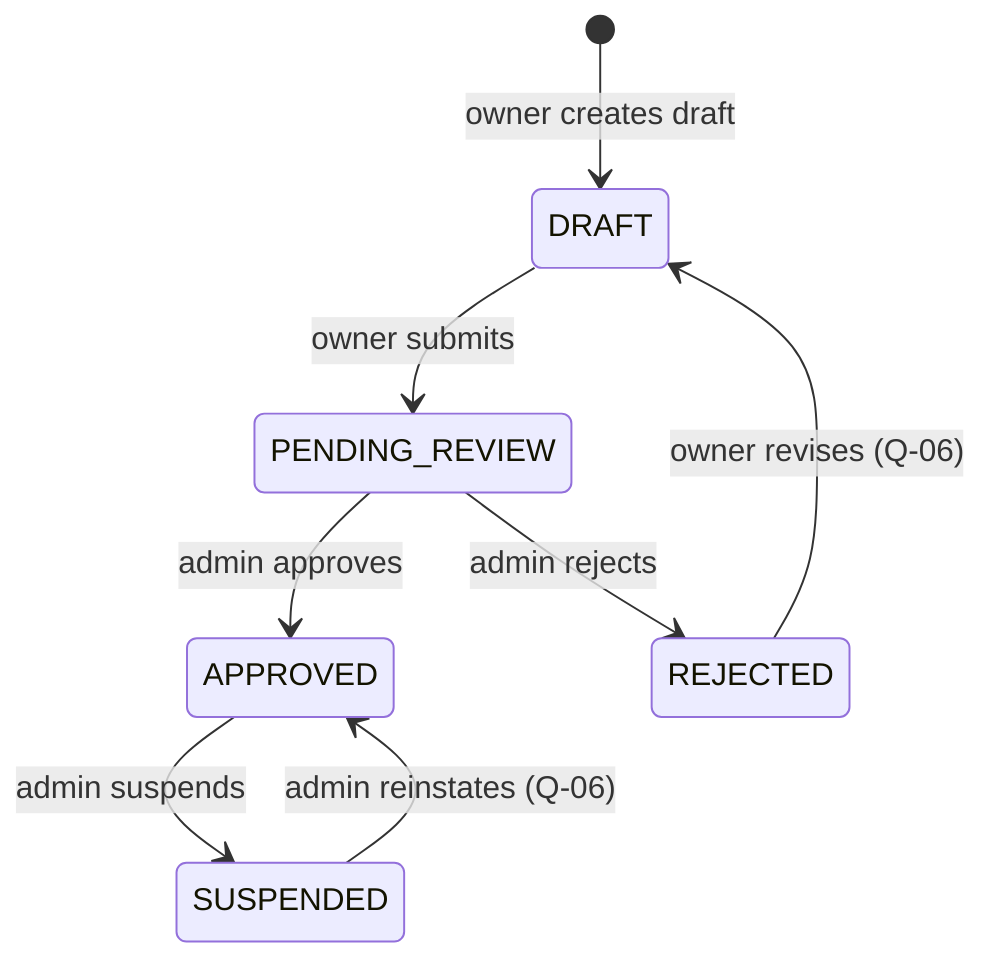

# Restaurant lifecycle

## States

| Status           | Meaning                                            | Public / searchable | Bookable |
| ---------------- | -------------------------------------------------- | ------------------- | -------- |
| `DRAFT`          | Being configured by the owner.                     | No                  | No       |
| `PENDING_REVIEW` | Submitted; awaiting an admin decision.             | No                  | No       |
| `APPROVED`       | Verified by an admin.                              | Yes                 | Yes      |
| `REJECTED`       | Admin rejected the latest submission.              | No                  | No       |
| `SUSPENDED`      | Admin removed an approved restaurant from service. | No                  | No       |

## Transitions

| Transition                    | Actor | Preconditions                            | Side effects                                                                                                        |
| ----------------------------- | ----- | ---------------------------------------- | ------------------------------------------------------------------------------------------------------------------- |
| create → `DRAFT`              | Owner | —                                        | BookingSettings created with defaults (duration 120, deadline 120).                                                 |
| `DRAFT` → `PENDING_REVIEW`    | Owner | Completeness check (see below).          | New RestaurantSubmission; audit log.                                                                                |
| `PENDING_REVIEW` → `APPROVED` | Admin | Open submission exists.                  | Submission decided; audit log; outbox → index in search.                                                            |
| `PENDING_REVIEW` → `REJECTED` | Admin | Open submission exists. Reason required. | Submission decided; audit log.                                                                                      |
| `APPROVED` → `SUSPENDED`      | Admin | Reason required.                         | Audit log; outbox → remove from search. Effect on future bookings: [Q-07](../open-questions.md#business-questions). |
| `REJECTED` → `DRAFT`          | Owner | —                                        | Only if confirmed by [Q-06](../open-questions.md#business-questions).                                               |
| `SUSPENDED` → `APPROVED`      | Admin | —                                        | Only if confirmed by [Q-06](../open-questions.md#business-questions).                                               |

Transitions labelled `(Q-06)` are **not** confirmed business rules. They are shown
so the diagram is complete and will be kept or removed after review.

## Submission completeness

The admin verifies profile, location, menu, and photos. What the system must enforce
**before** allowing submission is not specified. Proposed minimum (to confirm, see
[Q-05](../open-questions.md#business-questions)):

- profile: name, description, cuisine(s), contact phone
- location: address, city, country, latitude, longitude, timezone, currency
- at least one photo
- at least one menu item
- at least one active resource
- at least one opening period
- booking settings present

## Changes after approval

Owners change configuration over time. Which changes to an `APPROVED` restaurant
require a new admin review is an open question ([Q-05](../open-questions.md#business-questions)).
Every owner configuration change is audited regardless.
